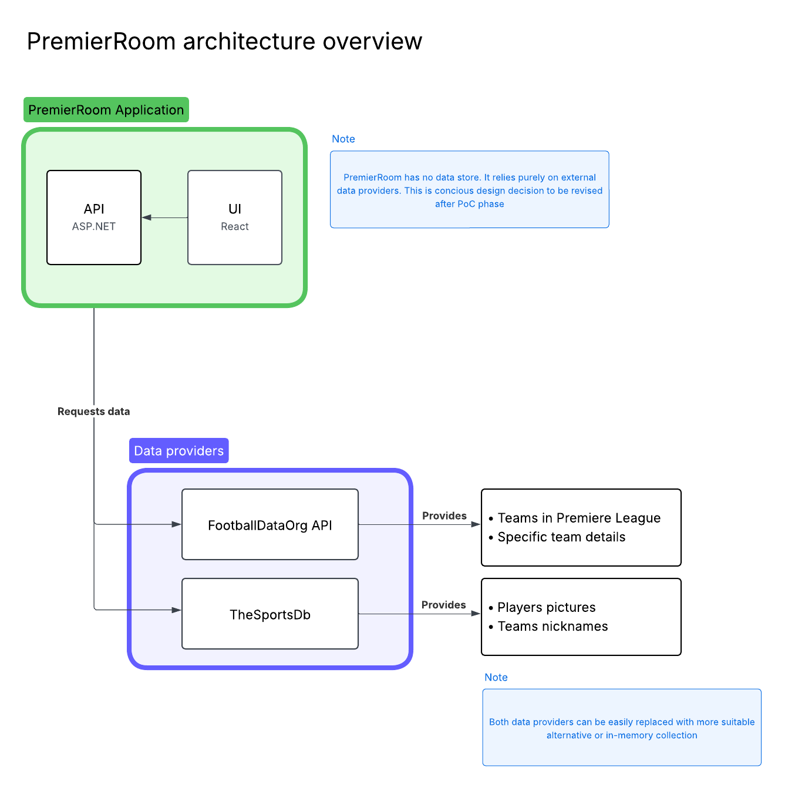
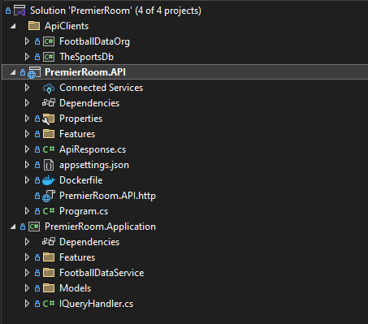
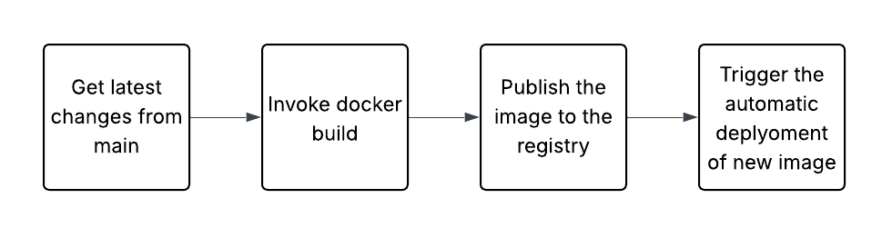
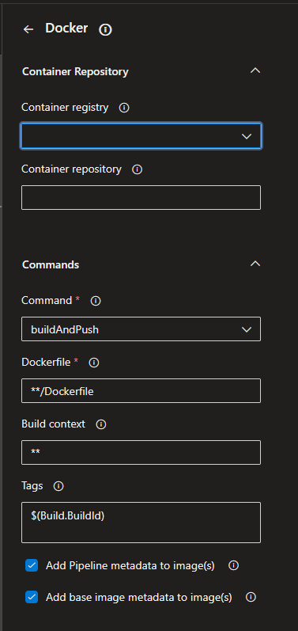

# PremierRoom

PremierRoom is an application designed for browsing Premier League teams and exploring detailed information about each team. The application provides an intuitive interface for Premier League enthusiasts to discover and learn about their favorite teams.

## Running the application

PremierRoom consists of ASP.NET API with React UI. Both applications are contenerized. A convinient `docker-compose.yml` is provided at the root level of the project. `docker compose up` will spin up API and UI containers. PremierRoom does not have a dedicated data store which makes running it much easier.

|     | http                  | https                  |
| --- | --------------------- | ---------------------- |
| API | http://localhost:9090 | https://localhost:9091 |
| UI  | -                     | https://localhost:9092 |

## High Level Design

### Data storage strategy

When designing the application one of the first design decision to make was what approach to take to data retrieval and data storage. After quick consideration I decided not to use a dedicated data store for the application.

All data is provided by two APIs - The Football Data org and The Sports DB. Those providers were chosen because of the offered coverage and availability of free tiers.

This decision was influenced mostly by two factors: time constraints to complete the task and focusing on delivering working PoC.

Skipping data storage and relying on external data providers speeds up initial development which is considered a most important factor when developing PoC (build, deploy and validate as quickly as possible).

The cons of this approach are also to be noted. Relying on external APIs can make application unstable and susceptible to external providers outages, pricing changes or even them ceasing to exist. This is unacceptable in production environment, but it's also a good tradeoff for PoC stage.

#### Tradeoffs

##### Rate limits

Both APIs have their own rate limits. Free tiers allow to fetch some amout of data, but using the application more they quickly hit limit thresholds. The application is built so it can work as long as possible uninterrupted (memory caching, fallback strategies in API clients). Unfortunately some free tier rate limits are so low they are practically unusable beyond simplest PoC application.

## Backend API

Backend API is an ASP.NET Minimal API application. It consists of 4 projects

The overall architecture is vertical slices. The main assumption of this architecture is to keep things related to eachother (DTOs, mappers, handlers, etc.) close (in one folder) instead of dividing them into categories folders. This makes reading the code and modifying it easier - it is clear which classes can be involved with handling a specific API request.

Main project is PremierRoom.API which uses PremierRoom.Application for all application logic. More details about each project can be found below.

### ApiClients

ApiClients solution folder contains two API clients developed as data sources for the actual application. They contain only relevant methods and data structures (KISS, YAGNI). They have some resilience built-in using Polly however it's mostly for demostration purposes - they are not fine tuned to each provider limits and quirks (for example: weird response codes).

Both projects include `ServiceCollectionExtensions.cs` file which contains all code responsible for adding them to DI container as a whole package. Downstream users don't need to know exactly which services are to be registered witch each client. They only need to provide configuration in expected format. This makes consuming those clients much easier.

### PremierRoom.API

It's a core project responsible for handling actual HTTP requests. It's responsibility is to accept request, map path params and request body to appropriate request DTO, construct a query object, invoke the query handler and map processing result to the response DTO.

#### Cross cutting concernes and tests

Keeping it mind it's a PoC concerns like authentication or authorization were ignored.

While unit tests are vital when building a production application I decided to skip them for this assignement. This gave me more time to focus on building the actual assignement application.

### PremierRoom.Application

This project is responsible for defining and actual execution of application logic. It consists of query handlers which correspond to the exposed API endpoints. They accept their dedicated query objects and return application models in response.

#### IFootballDataService

This interface provides an API required to be able to support current use cases of the application. It's purpose is to abstract away actual implementation keeping the option to substitute the data provider open.

There are two example implementations - one actually used in the application (FootbalDataOrg) and one to show one of the potential different implementations: InMemory. It could be useful as data fallback if external API breaks to keep the app running or to be used in unit tests.

#### Cache

The `IFootballDataService` implementation uses `MemoryCache` to reduce number of requests being issued to the external API. This is to provide as much uninterrupted work as possible. Adding cache follows the decorator pattern to keep the responsibilities separated.

#### Enhancers

Early in the development process I realized that none API provides both of two things: 1) convinient access to data and 2) required data coverage. That drove the decision to try to aggregate data from multiple sources in order to construct result data set containing all required information.

Core data source is FootballDataOrg API which returns all teams and their respective squads. Profile pictures and teams nicknames are fetched from TheSportsDB API (as highlighted in the HLD).

Easiest solution to this problem would be to embed all necessary calls to all APIs inside one method (for example in query handler). This would work fine as long as the amount of data sources would not grow. To keep the architecture more receptive to future changes I came up with enhancers concept.

The idea is simple - application fetches data from primary data source and they try to enhance it and supplement with data that's missing. Each enhancer is responsible for providing only a small subset of data (profile picture for player or team nicknames for example). The technical implementation assumes each enhancer is idependent and lives in a separate classes. This makes this approach more testable and future changes tolerant than the most obvious solution mentioned above.

The enhancers are registered in DI container and then injected into query handlers as `IEnumerable<IEnhancer<T>>` so multiple enhancers can be added to the application and this would not require any changes to the consuming code (query handler).

## UI

UI is a simple React application. Most important npm packages it uses:

- Vite
- Tailwind CSS - for styling
- TanStack Router - for routing
- TanStack Query - for easier data fetching and bonuses like caching available out of the box
- openapi-typescript - for API client generation

PremierRoom.UI is ment to be a thin client for the API. This means most of the actual logic happens on the backend - frontend is just responsible for invoking apropriate endpoint and displaying returned data.

Similarly to backend part skipping some of the vital parts of the actual applications (authorization, test etc.), frontend provides some styling, UI/UX was definitely not the main focus.

The application consists of 2 main components: `AllTeams.tsx` and `SpecificTeam.tsx`.

`AllTeams.tsx` is main component of the application responsible for displaying list of all teams currently in Premier League. It also includes a search input which can be used to narrow the list down using team name or one of it's nicknames.

`SpecificTeam.tsx` simply displays the team name and whole squad.

Each component uses TanStack Router's `loader` method to fetch the data. A `pendingComponent` is also displayed while selecting a specific team to indicate data loading is in progress.

### API client generation

`openapi-typescript` is used to generate the type-safe API client. From my experience most of the time such clients are generated during CI/CD build and exposed to the rest of the organization as npm package. My approach is slightly different: API client is generated by the UI application itself. This ensures the API client is always updated with necessary changes and the client update lives in the same commit as the rest of feature-related work.

## Deplyoment

### Backend

API application is contenerized which enables multiple deployment strategies. One of the most popular one is to deploy the application to a Kubernetes cluster. I personally did that for two projects (commercial and personal) using Rancher as managment tool.

I have the most experience with CI/CD tooling in Azure DevOps. It has task to handle building and publishing Docker images to a registry

After the image is uploaded tool like Keel can be used to automate the deployment.

When deployment finishes we can confirm in the Rancher UI the new version of the application is used for serving workload.

### UI

My go-to pipeline to deploy UI applications is building them during CI/CD and uploading the result to the blob storage.

Files from this blob storage can then be served by any web server (example: nginx)

## Challenges

Here's a list of some technical and business challenges I encountered during my work on this assignement

### 1. Finding good data source

Not previously working in football industry I didn't know which API would be the best for my use case. It had to offer Premier League coverage and offer a free tier. I used Claude for research - this allowed me to quickly get to know all the possible options.

### 2. API rate limits

As mentioned above integrated APIs have different (and sometimes quite strict) rate limits. While they suffice for simple PoC, they are definitely not suitable for production use. If application like this would be to go production-grade, those APIs are still viable options (PoC confirmed they can be used). For production I would implement asynchrounous data scraping and store the results in internal data store improving reliability.

### 3. Integrating multiple APIs inside one application

Being able to return as extensive as possible set of data was important when designing the application. This meant multiple datasources will need to be used. Unfortunately it is not an easy task to match the clubs and players between data providers (they have different IDs, but can also have different names!). For the PoC I went with naive approach - FootballDataOrg provides two types of names for a team: short and long. When querying TheSportsDb for any given team short name is used. If it's not available system uses the long one. This approach came from the obervation that TheSportsDb mostly uses the simplest versions as their primary names (for example: `Arsenal` instead of `Arsenal FC`)
