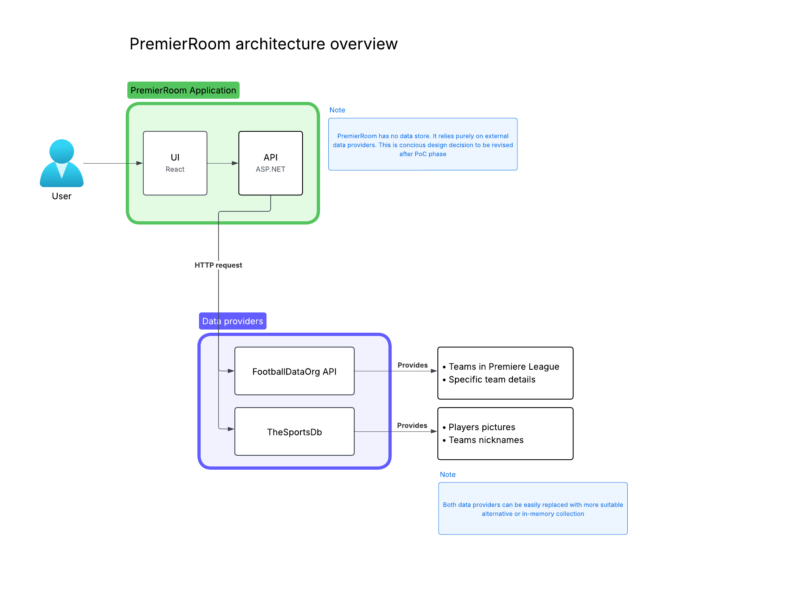

# PremierRoom

PremierRoom is an application designed for browsing Premier League teams and exploring detailed information about each team. The application provides an intuitive interface for Premier League enthusiasts to discover and learn about their favorite teams.

## Running the application

PremierRoom consists of ASP.NET API with React UI. Both applications are contenerized. A convinient `docker-compose.yml` is provided at the root level of the project. `docker compose up` will spin up API and UI containers. PremierRoom does not have a dedicated data store which makes running it much easier.

|     | http                  | https                  |
| --- | --------------------- | ---------------------- |
| API | http://localhost:9090 | https://localhost:9091 |
| UI  | -                     | https://localhost:9092 |

## High Level Design

### Data storage strategy

When designing the application one of the first design decision to make was what approach to take to data retrieval and data storage. After quick consideration I decided not to use a dedicated data store for the application.

This decision was influenced mostly by two factors: time constraints to complete the task and it being in PoC stage.

Skipping data storage and relying on external data providers speeds up initial development which is considered a most important factor when developing PoC (build, deploy and validate as quickly as possible).

The cons of this approach are also to be noted. Relying on external APIs can make application unstable and susceptible to external providers outages, pricing changes or even them stopping to exist. This is unacceptable in production environment, but it's also a good tradeoff for PoC stage
